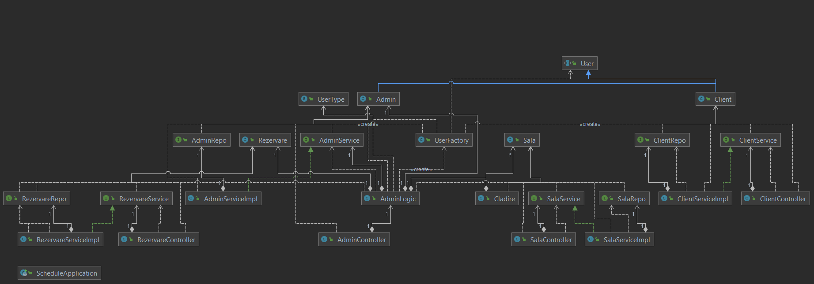

# scheduler
# Planificator online de sali de evenimente

Proiectul de fata reprezinta o aplicatie care doreste sa eficientizeze munca unui detinator de sali de 
evenimente. Acesta ar trebui sa verifice de fiecare data:
-la ce ora doreste clientul sa inchirieze clientul sala;
-daca mai are sali libere la ora aceea.
Aplicatia automatizeaza aceasta functie. Clientul poate rezerva o sala x de evenimente timp de o ora de la 
o ora X aleasa de el prin aplicatie. 

#Pachete

Aplicatia contine un total de 6 pachete.

#Main

-pachetul "com.example.schedule" contine main-ul aplicatiei care porneste aplicatia springboot.

#Model

-pachetul "model" contine modelele claselor de care are nevoie aplicatia: client, admin, rezervare,
sala, cladire, user,userFactory si un enum cu tipurile de user: CLient si admin.
Toti userii au nume, prenume,email,username,pass (parola). clasa asta este abstracta deoarece dorim
sa implementam factory pattern pentru useri, astfel incat sa putem sa putem pune toti userii intr-ul loc,
fie ei clienti sau admini. Clasele client si admin extind clasa user pentru a ne ajuta ulterior sa putem 
distinge ulterior drepturile unui client de cele ale unui client. Clientul poate sa faca o noua rezervare, 
adminul trebuie sa poata sa stearga,modifice,adauge rezervari, sali si clienti. 
Rezervarea este contractul care contine orele la care sunt ocupate salile. UserFactory este clasa care 
contine metoda "createUser" care creaza un user de tipul dat ca parametru. 

#Repos

-pachetul repos contine cate o clasa pentru fiecare obiect care extinde JpaRepository

#Services

-pahcetul Service cotine cate o interfata pentru fiecare clasa din model si cate o implementare. Aici sunt
implementate operatiile crud pe baza de date. FindById, save, delete. Aceste functii sunt indeplinite cu cate
un atribut de tip repo al clasei corespondente din model

#Logic
 
-pachetul acesta contine o clasa AdminLogic care contine toata logica aplicatiei controlata de admin.
Atunci cand trebuie introdus, sters sau aduagat ceva clasa admin cu toate clasele ei corespondente trebuie
sa se ocupe.

#Controllers

pachetul Controllers contine controllerele corespondente claselor din model. Aici sunt apelate 
metodele din clasele Service. 

Toata aplicatia contine adnotari, iar in clasele din Controllers este sunt mapate request-urile pentru 
endpoints. 

Diagrama de dependente

